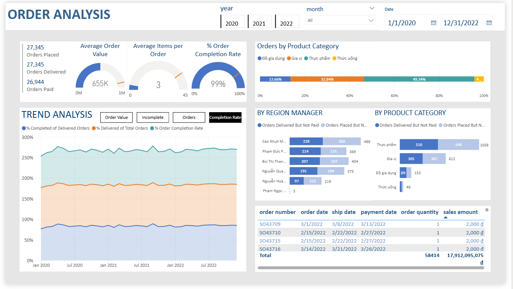

# Project Details — KPIM Mart Order Analysis Dashboard

---

## Dashboard Preview

---

## Data Source
- Raw data provided in **Excel files**
- Loaded into Power BI via **Power Query**
- Additional columns added to several tables during transformation

---

## Data Model

The data model follows a **Snowflake Schema** with **2 Fact Tables**:
- `fact_sales` — transactional sales data
- `fact_sales_plan` — sales plan/target data

Connected to dimension tables: `dim_customer`, `dim_product`, `dim_store`, `dim_date`, `dim_promotion`

---

## Slicers
Located in the top navigation bar, allowing users to filter the entire dashboard by:
- **Year** — toggle between 2020, 2021, 2022
- **Month** — dropdown to filter by specific month
- **Date Range** — custom start and end date picker

---

## Bookmarks
Used in the **Trend Analysis** section to toggle between different chart views without leaving the page:
- **Order Value** — shows average order value trend over time
- **Incomplete** — highlights incomplete/undelivered orders trend
- **Orders** — displays total order volume trend
- **Completion Rate** — shows % order completion rate trend

---

## DAX Measures
- Orders Placed
- Orders Delivered
- Orders Paid
- Orders Placed But Not Shipped
- Orders Shipped But Not Delivered
- % Delivered of Total Orders
- % Completed of Delivered Orders
- Average Order Value
- Average Items per Order
- % Order Completion Rate
- ....
